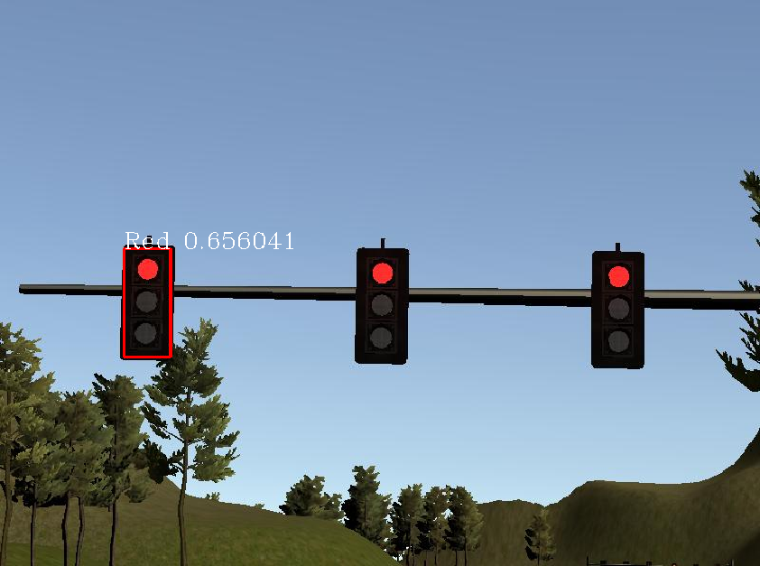
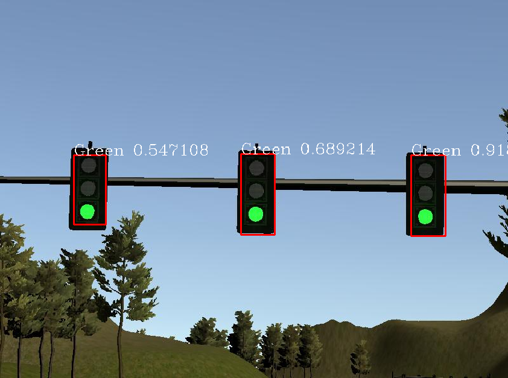
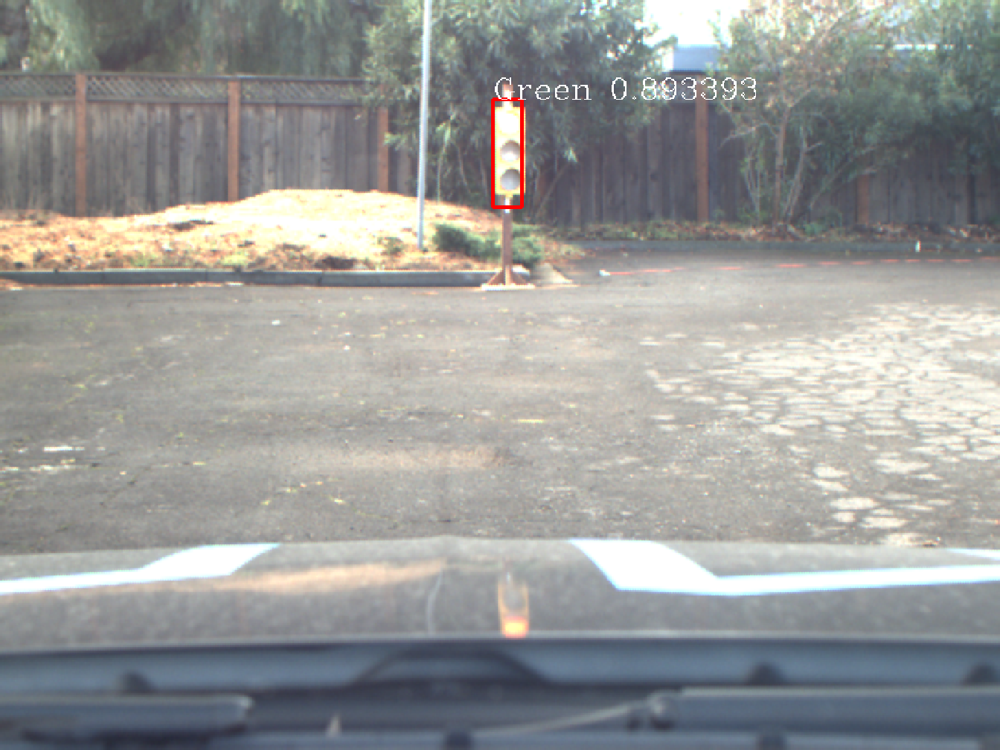
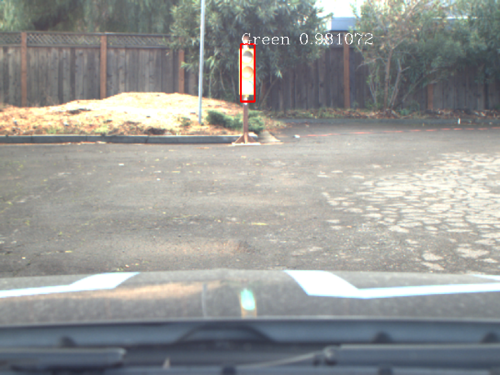
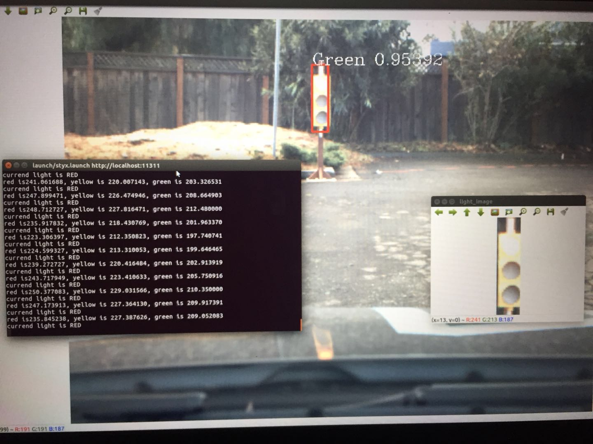
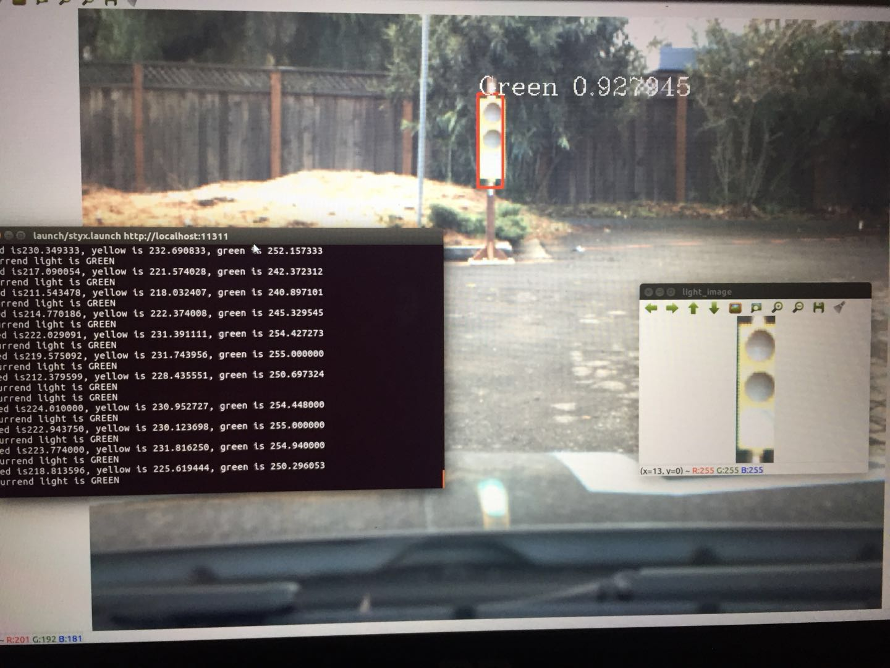

### Traffic Light detection model
This node is used for publishing the stop pose base on nearest the traffic light is red or not. I used the KDTREE to find the closest the point in the waypoints between the pose of the car and the pose of the traffic light. If the traffic light is red, the node would publish the stop point. 

### Traffic Light classifed 
This part is used for classfied the traffic light is red or not. I created the model with using TensorFlow's Object Detection API. I refer to the following two blogs for training traffic light detection model.
* [Tensorflow object detection API Installed](https://www.cnblogs.com/zongfa/p/9662832.html)

**Importance: must download version 1.4.0,only with this version training mode which can work in this project well** 
* [Tensorflow object detection API Course training my model](https://www.cnblogs.com/zongfa/p/9663649.html)

The steps I created the classfied model is follows:
* First, I used the this project to save the whole image to *.png file from the ros topic which is /image_color. The images include simulator and real world training bag.

* I used the [labelImg] (https://github.com/tzutalin/labelImg) tool to label pictures manually. I labeled three kinds labels include red light, yellow light and green light. So that I can classfy the traffic light just based on detection not used classfied model. 

* I trained the traffic light detection model based on two model architectures include Faster R-CNN
Resnet 101 and ssd_mobilenet_v1_coco. By comparison detecion reslut, at last I used the ssd_mobilenet_v1_coco model architecture.

* I trained two models based on the simulator and the real world data bag, respectively. Because the feature of the traffic light from simulator and training bag is different.

* I writed tl_classifier.py based on the [object_detection_tutorial.ipynb](https://github.com/tensorflow/models/tree/master/research/object_detection).

The classified result:
* I test the traffic light detection function in the simulator with site.launch. The detection rate is very well.The classifier result examples:



* I test the traffic light detection function with the real world training bag. It can detect the traffic light detection well. But it can't classfy the light is red or other color. The classfied rate is very low. The classifier result bad examples:



So I created a simple classifier depend on the color characteristics of the light. 

#### simple light classifier based on color
1. I removed the topest and bottomest part of the light image for Denoising.
2. I splited the image into three parts at height. The top image is the pose of red light. The middle is yellow. The bottom is green.
3. I converted image from BGR to HSV format. The 3rd channel of HSV image is brightness. 
4. I can get the means of three parts of brightness. If the brightness mean of the red part is biggest. The light is red.



This is the project repo for the final project of the Udacity Self-Driving Car Nanodegree: Programming a Real Self-Driving Car. For more information about the project, see the project introduction [here](https://classroom.udacity.com/nanodegrees/nd013/parts/6047fe34-d93c-4f50-8336-b70ef10cb4b2/modules/e1a23b06-329a-4684-a717-ad476f0d8dff/lessons/462c933d-9f24-42d3-8bdc-a08a5fc866e4/concepts/5ab4b122-83e6-436d-850f-9f4d26627fd9).

Please use **one** of the two installation options, either native i**or** docker installation.

### Native Installation

* Be sure that your workstation is running Ubuntu 16.04 Xenial Xerus or Ubuntu 14.04 Trusty Tahir. [Ubuntu downloads can be found here](https://www.ubuntu.com/download/desktop).
* If using a Virtual Machine to install Ubuntu, use the following configuration as minimum:
  * 2 CPU
  * 2 GB system memory
  * 25 GB of free hard drive space

  The Udacity provided virtual machine has ROS and Dataspeed DBW already installed, so you can skip the next two steps if you are using this.

* Follow these instructions to install ROS
  * [ROS Kinetic](http://wiki.ros.org/kinetic/Installation/Ubuntu) if you have Ubuntu 16.04.
  * [ROS Indigo](http://wiki.ros.org/indigo/Installation/Ubuntu) if you have Ubuntu 14.04.
* [Dataspeed DBW](https://bitbucket.org/DataspeedInc/dbw_mkz_ros)
  * Use this option to install the SDK on a workstation that already has ROS installed: [One Line SDK Install (binary)](https://bitbucket.org/DataspeedInc/dbw_mkz_ros/src/81e63fcc335d7b64139d7482017d6a97b405e250/ROS_SETUP.md?fileviewer=file-view-default)
* Download the [Udacity Simulator](https://github.com/udacity/CarND-Capstone/releases).

### Docker Installation
[Install Docker](https://docs.docker.com/engine/installation/)

Build the docker container
```bash
docker build . -t capstone
```

Run the docker file
```bash
docker run -p 4567:4567 -v $PWD:/capstone -v /tmp/log:/root/.ros/ --rm -it capstone
```

### Port Forwarding
To set up port forwarding, please refer to the [instructions from term 2](https://classroom.udacity.com/nanodegrees/nd013/parts/40f38239-66b6-46ec-ae68-03afd8a601c8/modules/0949fca6-b379-42af-a919-ee50aa304e6a/lessons/f758c44c-5e40-4e01-93b5-1a82aa4e044f/concepts/16cf4a78-4fc7-49e1-8621-3450ca938b77)

### Usage

1. Clone the project repository
```bash
git clone https://github.com/udacity/CarND-Capstone.git
```

2. Install python dependencies
```bash
cd CarND-Capstone
pip install -r requirements.txt
```
3. Make and run styx
```bash
cd ros
catkin_make
source devel/setup.sh
roslaunch launch/styx.launch
```
4. Run the simulator

### Real world testing
1. Download [training bag](https://s3-us-west-1.amazonaws.com/udacity-selfdrivingcar/traffic_light_bag_file.zip) that was recorded on the Udacity self-driving car.
2. Unzip the file
```bash
unzip traffic_light_bag_file.zip
```
3. Play the bag file
```bash
rosbag play -l traffic_light_bag_file/traffic_light_training.bag
```
4. Launch your project in site mode
```bash
cd CarND-Capstone/ros
roslaunch launch/site.launch
```
5. Confirm that traffic light detection works on real life images

### Other library/driver information
Outside of `requirements.txt`, here is information on other driver/library versions used in the simulator and Carla:

Specific to these libraries, the simulator grader and Carla use the following:

|        | Simulator | Carla  |
| :-----------: |:-------------:| :-----:|
| Nvidia driver | 384.130 | 384.130 |
| CUDA | 8.0.61 | 8.0.61 |
| cuDNN | 6.0.21 | 6.0.21 |
| TensorRT | N/A | N/A |
| OpenCV | 3.2.0-dev | 2.4.8 |
| OpenMP | N/A | N/A |

We are working on a fix to line up the OpenCV versions between the two.
